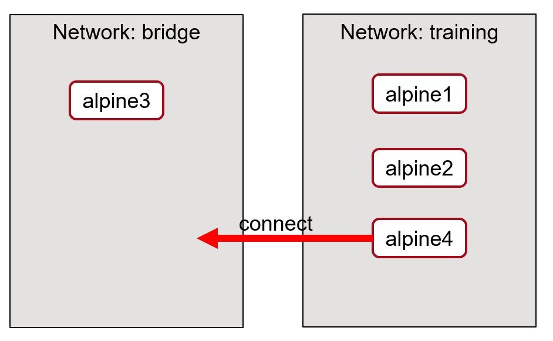
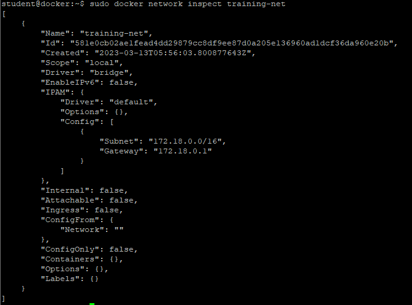
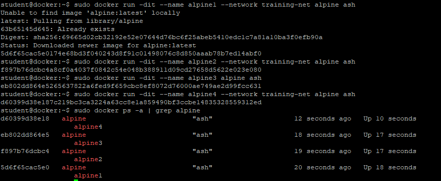
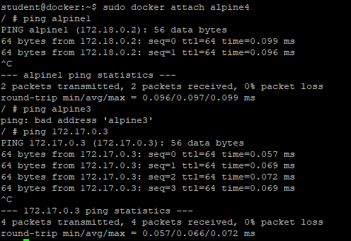

# Docker Network
Zadaniem będzie utworznie nowej sieci (Custom Network), uruchomienie w niej kontenerów oraz sprawdzenie możliwości komunikacji między kontenerami w tej samej sieci i między sieciami.



1. Wyświetl sieci 
```
sudo docker network ls
```


2. Utwórz sieć 'training-net'
```
sudo docker network create --driver bridge training-net
```


3. Wyświetl konfigurację sieci 'training-net'
```
sudo docker network inspect training-net
```


4. Utwórz kontenery w odpowiednich podsieciach zgodnie z rysunkiem powyżej
```
sudo docker run -dit --name alpine1 --network training-net alpine ash
sudo docker run -dit --name alpine2 --network training-net alpine ash
sudo docker run -dit --name alpine3 alpine ash
sudo docker run -dit --name alpine4 --network training-net alpine ash
```


5. Dołącz kontener "apline4" do sieci bridge
```
sudo docker network connect bridge alpine4
```

6. Wyświetl kontenery i ich adresy IP
```
sudo docker ps -q | xargs -I [] sudo docker inspect -f '{{.Name}}: {{range.NetworkSettings.Networks}}{{.IPAddress}} {{end}}' []
```
Wynik
```
/alpine4: 172.18.0.4 172.17.0.3 
/alpine3: 172.17.0.2 
/alpine2: 172.18.0.3 
/alpine1: 172.18.0.2
```


7. Połącz się z kontenerem "alpine2" w sieci "training-net" a następnie spróbuj "pingować" kontener "alpine1" w sieci "training-net"
```
sudo docker attach alpine2
/ # ping alpine1
PING alpine1 (172.18.0.2): 56 data bytes
64 bytes from 172.18.0.2: seq=0 ttl=64 time=0.110 ms
64 bytes from 172.18.0.2: seq=1 ttl=64 time=0.074 ms
64 bytes from 172.18.0.2: seq=2 ttl=64 time=0.082 ms
^C
--- alpine1 ping statistics ---
3 packets transmitted, 3 packets received, 0% packet loss
round-trip min/avg/max = 0.074/0.088/0.110 ms

/ # ping 172.18.0.2
PING 172.18.0.2 (172.18.0.2): 56 data bytes
^C
--- 172.18.0.2 ping statistics ---
4 packets transmitted, 4 packets received, 0% packet loss
/ # Ctrl+p Ctrl+q
```


8. Połącz się z kontenerem "alpine3" w sieci "bridge" a następnie spróbuj "pingować" kontener "alpine1" w sieci "training-net"
```
sudo docker attach alpine3
/ # ping alpine1
ping: bad address 'alpine1'

/ # ping 172.18.0.3
PING 172.18.0.3 (172.18.0.3): 56 data bytes
^C
--- 172.18.0.3 ping statistics ---
4 packets transmitted, 0 packets received, 100% packet loss
/ # Ctrl+p Ctrl+q
```


9. Połącz się z kontenerem "alpine4" w sieci "training-net" a następnie spróbuj "pingować" kontener "alpine1" w sieci "training-net" oraz "alpine3" w sieci "bridge"
```
sudo docker attach alpine4
/ # ping alpine1
PING alpine1 (172.18.0.2): 56 data bytes
64 bytes from 172.18.0.2: seq=0 ttl=64 time=0.110 ms
64 bytes from 172.18.0.2: seq=1 ttl=64 time=0.074 ms
64 bytes from 172.18.0.2: seq=2 ttl=64 time=0.082 ms
^C
--- alpine1 ping statistics ---
3 packets transmitted, 3 packets received, 0% packet loss

/ # ping alpine3
ping: bad address 'alpine3'

/ # ping 172.17.0.3
PING 172.17.0.3 (172.17.0.3): 56 data bytes
64 bytes from 172.17.0.3: seq=0 ttl=64 time=0.260 ms
64 bytes from 172.17.0.3: seq=1 ttl=64 time=0.076 ms
^C
--- 172.17.0.3 ping statistics ---
2 packets transmitted, 2 packets received, 0% packet loss
round-trip min/avg/max = 0.076/0.168/0.260 ms
/ # Ctrl+p Ctrl+q
```


10. Usuń kontenery i sieć 'training-net'
```
sudo docker container rm -f alpine1 alpine2 alpine3 alpine4
sudo docker network rm training-net
```
