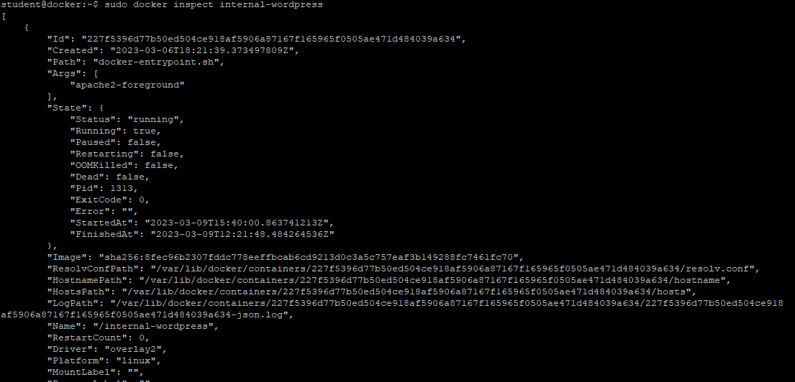

# Inspekcja kontenerów 
Ćwiczenie pokaże w jaki sposób uzyskać informacje o konfiguracji kontenerów i parametrach jego pracy.

1. Pokaż pełną informację o kontenerze "internal-wordpress"
```
sudo docker inspect internal-wordpress
```


2. Pokaż zajętość dysku przez kontener "internal-wordpress"
```
sudo docker inspect --size internal-wordpress -f '{{ .SizeRootFs }}'
```


3. Pokaż zajętość dysku przez kontener "internal-wordpress" ale tylko dopisanych od czasu uruchomienia. 
```
sudo docker inspect --size internal-wordpress -f '{{ .SizeRw }}'
```


4. Pokaż konfigurację sieciową kontenera "internal-wordpress"
```
sudo docker inspect --format='{{range .NetworkSettings.Networks}}{{.MacAddress}}{{end}}' internal-wordpress
```


5. Pokaż adress IP kontenera "internal-wordpress"
```
sudo docker inspect --format='{{json .NetworkSettings}}' internal-wordpress
```


6. Pokaż Nazwę kontnera oraz status dla wszystkich kontenerów
```
sudo docker ps -a --format '{{.Names}}\t{{.Status}}'
```


7. Pokaż nazwę kontenera oraz ścieżkę do LogPath dla wszystkich kontnerów
```
sudo docker inspect --format='{{.Name}} {{.LogPath}}' $(sudo docker ps -qa)
```


8. Sprawdź ile zajmuja wszystkie logi kontenerów
```
sudo su
du -sh /var/lib/docker/containers/*/*-json.log
```

